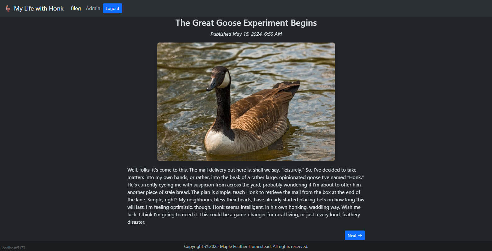

# Lab 10.4: Dynamic Routing

[Karl Johnson](https://github.com/hirekarl)  
2025-RTT-30  
<time datetime="2025-08-07">2025-08-07</time>  



## Overview
### Viewer Instructions
1. Run the following in the terminal:

```bash
cd dynamic-routing && npm i && npm run dev
```

2. Navigate to http://localhost:5173/blog in the browser.

### Submission Source
Top-level application behavior can be found in [`./dynamic-routing/src/App.tsx`](./dynamic-routing/src/App.tsx).

### Reflection
> TODO

## Assignment
You are tasked with building a small but feature-rich blog application. This will require you to implement a core feature of modern web applications: dynamic routing. You’ll create a system where a list of blog posts links to individual, dynamically generated pages for each post.

Furthermore, you will implement a basic authentication system and create a “protected” admin area that is only accessible to logged-in users, a common requirement in real-world applications.

This lab will give you hands-on experience with React Router and handling URL parameters.

## Attributions
- [goose-min.jpg](./dynamic-routing/public/goose-min.jpg): Photo by Oliver Wagenblatt: https://www.pexels.com/photo/close-up-of-a-canadian-goose-on-water-32825967/
- [goose2-min.jpg](./dynamic-routing/public/goose2-min.jpg): Photo by Brett Sayles: https://www.pexels.com/photo/canadian-goose-on-grass-field-1073089/
- Additional photos ([christmas-min.png](./dynamic-routing/public/christmas-min.png), [postmaster.png](./dynamic-routing/public/postmaster-min.png)) generated with ChatGPT
- Blog posts written with Google Gemini
